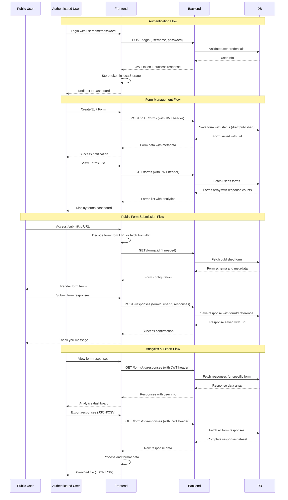

# JSON-to-Form Renderer

A full-stack application for creating, editing, publishing, and managing dynamic forms with response collection and analytics.

## Application Flow (Sequence Diagram)



## Prerequisites

| Software | Minimum Version | Recommended Version |
| -------- | --------------- | ------------------- |
| Node.js  | 18.x            | 20.x                |
| npm      | 9.x             | 10.x                |
| Git      | 2.30            | Latest              |
| MongoDB  | 4.4             | Latest              |

## Quick Start

1. **Clone the Repository**

   ```sh
   git clone <repository-url>
   cd json-to-form-renderer
   ```

2. **Install Dependencies**

   ```sh
   # Install backend dependencies
   cd backend && npm install
   # or
   cd backend && yarn install

   # Install frontend dependencies
   cd ../frontend && npm install
   # or
   cd ../frontend && yarn install
   ```

3. **Start Development Servers**

   ```sh
   # Terminal 1: Start backend (from backend/ directory)
   npm start
   # or
   yarn start

   # Terminal 2: Start frontend (from frontend/ directory)
   npm run dev
   # or
   yarn dev
   ```

4. **Access the Application**
   - Frontend: http://localhost:5173
   - Backend API: http://localhost:4000
   - API Documentation: http://localhost:4000/api-docs

---

## 📱 Frontend

### Features

- ✨ Modern, responsive UI with Tailwind CSS
- 🎨 Create, edit, and clone forms from JSON schemas
- 📝 Draft and publish forms with live preview
- 📊 View analytics (response counts)
- 📤 Export responses as JSON or CSV
- 🔐 JWT authentication with secure sessions
- 🔔 Toast notifications and loader overlays
- 📚 Example forms and documentation pages
- ♿ Accessibility-focused design

### Development Commands

| Command                                        | Description                 | Expected Outcome                                        |
| ---------------------------------------------- | --------------------------- | ------------------------------------------------------- |
| `npm run dev` / `yarn dev`                     | Start development server    | Local server at `http://localhost:5173` with hot reload |
| `npm run build` / `yarn build`                 | Build for production        | Compiled files in `dist/` directory                     |
| `npm run preview` / `yarn preview`             | Preview production build    | Local server serving `dist/` at `http://localhost:4173` |
| `npm run lint` / `yarn lint`                   | Run ESLint for code quality | Displays lint errors/warnings in terminal               |
| `npm test` / `yarn test`                       | Run all Jest test cases     | Shows test results and summary                          |
| `npm run test:watch` / `yarn test:watch`       | Run tests in watch mode     | Re-runs tests on file changes                           |
| `npm run test:coverage` / `yarn test:coverage` | Generate coverage report    | Coverage report in `coverage/` folder                   |

### Project Structure

```
frontend/
├── src/
│   ├── components/     # Reusable UI components
│   ├── pages/         # Page-level components
│   ├── api/           # API client and service logic
│   ├── types/         # TypeScript type definitions
│   ├── utils/         # Utility functions
│   └── styles/        # Global styles
├── __test__/          # Test files
├── coverage/          # Coverage reports
└── dist/              # Production build output
```

### Testing

- **Total Test Suites:** 39 (100% pass rate)
- **Total Tests:** 705 (0 failed, 0 skipped)
- **Coverage:** Available in `coverage/` directory
- **Framework:** Jest + React Testing Library

### Environment Variables

No environment variables are required for basic frontend setup.

---

## ⚙️ Backend

### Features

- 🚀 RESTful APIs for form management
- 💾 Store and retrieve form responses
- 🔒 JWT-based authentication
- 📈 Analytics (response counts)
- 🗄️ MongoDB database integration
- 📖 API documentation via Swagger
- ✅ Comprehensive test coverage

### Development Commands

| Command                                           | Description             | Expected Outcome                          |
| ------------------------------------------------- | ----------------------- | ----------------------------------------- |
| `npm start` / `yarn start`                        | Start backend server    | Server running at `http://localhost:4000` |
| `npm run dev` / `yarn dev`                        | Start with nodemon      | Development server with auto-restart      |
| `npm test` / `yarn test`                          | Run unit tests          | Test results and summary                  |
| `npm test -- --coverage` / `yarn test --coverage` | Run tests with coverage | Coverage report generated                 |

### API Endpoints

- **Authentication:** `/login`, `/register`
- **Forms:** `/forms` (CRUD operations)
- **Responses:** `/forms/:id/responses`
- **Documentation:** `/api-docs` (Swagger UI)

### Environment Variables

Create a `.env` file in the `backend/` directory:

```env
MONGODB_URI=mongodb://localhost:27017/formrenderer
JWT_SECRET=your_jwt_secret_here
PORT=4000
NODE_ENV=development
```

### Database Schema

```mermaid
erDiagram
	FORM {
		ObjectId _id
		string name
		string status
		string url
		object schema
		date createdOn
		date updatedOn
	}
	RESPONSE {
		ObjectId _id
		string userId
		ObjectId formId
		object responses
		date submittedOn
	}
	USER {
		ObjectId _id
		string username
		string password
		date createdOn
		date updatedOn
	}

	FORM ||--o{ RESPONSE : "formId references _id"
	USER ||--o{ RESPONSE : "userId references username"
```



### Project Structure

```
backend/
├── models/            # Database models and schemas
├── routes/            # API route handlers
├── middleware/        # Authentication and validation
├── schemas/           # Validation schemas
├── __tests__/         # Test files
├── coverage/          # Coverage reports
└── server.js          # Main server file
```

### Testing

Test files are located in the `__tests__/` directory and cover all major API endpoints.

**Troubleshooting:**

- Ensure MongoDB is running locally or update your `.env` with the correct URI
- If you see port conflicts, stop any running backend server before running tests
- For authentication-protected endpoints, tests automatically log in as the demo user

---

## Production Deployment

### Frontend

```sh
npm run build
# or
yarn build
# Serve the dist/ folder using any static file server
```

### Backend

- Use a production-ready MongoDB instance
- Set secure environment variables
- Use a process manager (e.g., PM2) for deployment

## Support & Documentation

- Frontend Guidelines: `frontend/src/guidelines/Guidelines.md`
- API Documentation: Available at `/api-docs` when backend is running
- Schema Definitions: See `backend/schemas/` folder

## License

MIT
