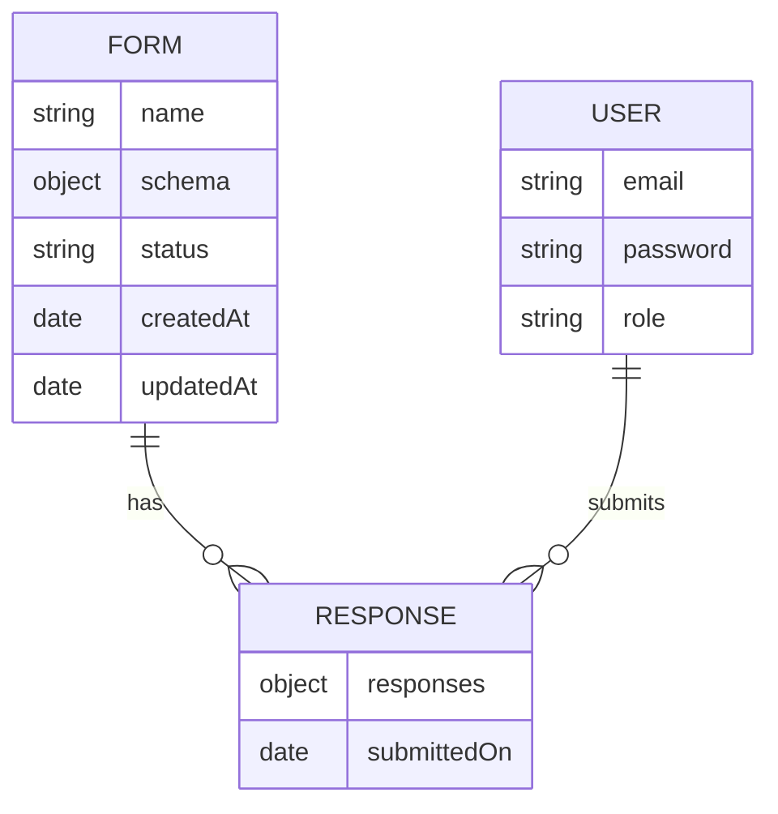

# Form Renderer Backend

This is the backend for the JSON-to-Form Renderer application. It provides RESTful APIs for form management, response collection, analytics, and user authentication.

## Features

- Create, edit, delete, and publish forms
- Store and retrieve form responses
- JWT-based authentication
- Analytics (response counts)
- MongoDB database integration
- API documentation via Swagger

## Prerequisites

- Node.js (v18 or higher recommended)
- npm or yarn
- MongoDB (local or remote)

## Installation

Install dependencies:

```sh
npm install
# or
yarn
```

## Development

Start the backend server:

```sh
npm start
# or
yarn dev
```

The server runs at `http://localhost:4000` by default.

## API Documentation

- Swagger UI available at `/api-docs` when the server is running

## Environment Variables

Create a `.env` file in the `backend/` directory for custom configuration:

```
MONGODB_URI=mongodb://localhost:27017/formrenderer
JWT_SECRET=your_jwt_secret
PORT=4000
```

## Testing

Run backend unit tests:

```sh
npm test
# or
yarn test
```

To run tests with coverage:

```sh
npm test -- --coverage
# or
yarn test --coverage
```

Test files are located in the `__tests__/` directory and cover all major API endpoints (forms, responses, users).

**Troubleshooting:**

- Ensure MongoDB is running locally or update your `.env` with the correct URI.
- If you see port conflicts, stop any running backend server before running tests.
- For authentication-protected endpoints, tests automatically log in as the demo user.

## Project Structure

## Main Schemas

### Schema Diagram



This diagram shows the relationships:

- Each `FORM` can have multiple `RESPONSE`s
- Each `USER` can submit multiple `RESPONSE`s

See the `schemas/` folder for full schema definitions and validation details.

## Production

- Use a production-ready MongoDB instance
- Set secure environment variables
- Use a process manager (e.g., PM2) for deployment

## License

MIT
