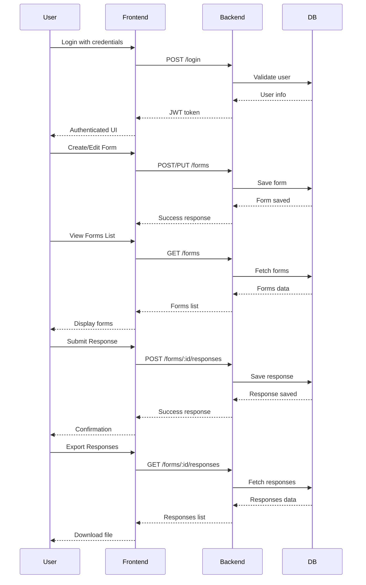

## Application Flow (Sequence Diagram)



# Form Renderer Frontend

This is the frontend for the JSON-to-Form Renderer application. It provides a modern, responsive UI for creating, editing, publishing, and managing dynamic forms, as well as viewing and exporting responses.

## Features

- Create, edit, and clone forms from JSON schemas
- Draft and publish forms
- View analytics (response counts)
- Export responses as JSON or CSV
- JWT authentication
- Loader overlays and toast notifications
- Example forms and documentation pages
- Responsive design with Tailwind CSS

## Prerequisites

- Node.js (v18 or higher recommended)
- npm or yarn
- Backend server running (see project root `PREREQUISITES.md`)

## Installation

Install dependencies:

```sh
npm install
# or
yarn
```

## Development

Start the development server:

```sh
npm run dev
# or
yarn dev
```

The app will run at `http://localhost:5173` by default.

## Testing

### Run Unit Tests

```sh
npm run test
# or
yarn test
```

### Check Test Coverage

```sh
npm run coverage
# or
yarn coverage
```

Coverage reports will be available in the `coverage/` folder.

## Production Build

Generate a production build:

```sh
npm run build
# or
yarn build
```

The output will be in the `dist/` folder. You can serve it using any static file server.

## Usage

- Log in with your credentials
- Create or edit forms using the editor
- Publish forms to make them available for responses
- View response analytics and export data

## Project Structure

- `src/` — Main source code
- `components/` — UI components
- `pages/` — Page-level components
- `api/` — API client and service logic
- `types/` — TypeScript types
- `styles/` — Global styles

## Environment Variables

No environment variables are required for basic frontend setup.

## Support & Documentation

- See the root `PREREQUISITES.md` for setup details
- See `src/guidelines/Guidelines.md` for schema authoring help

## License

MIT
